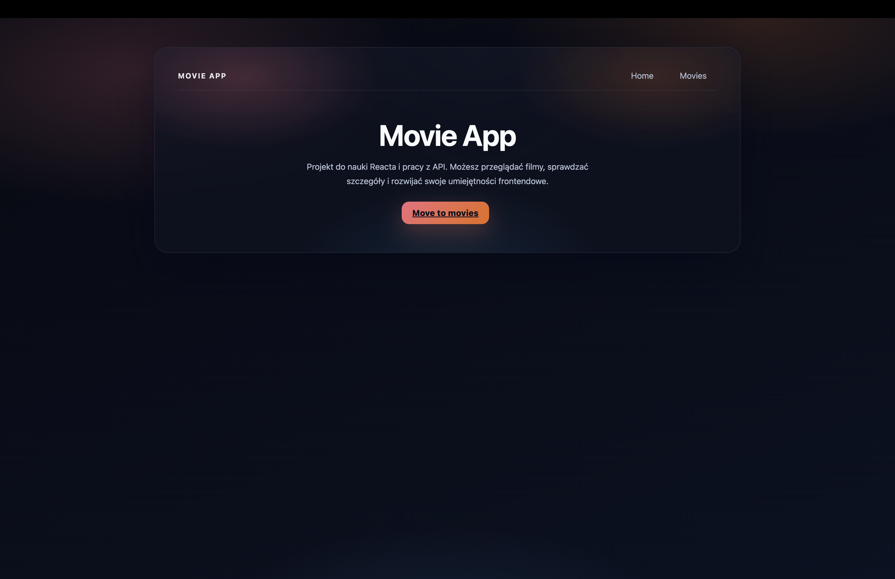
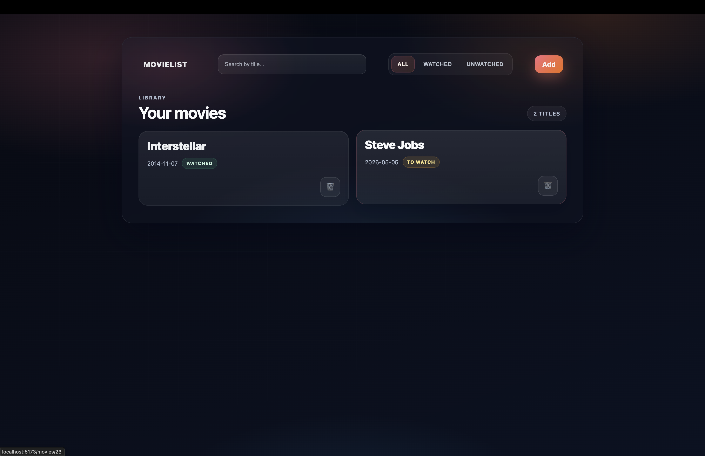
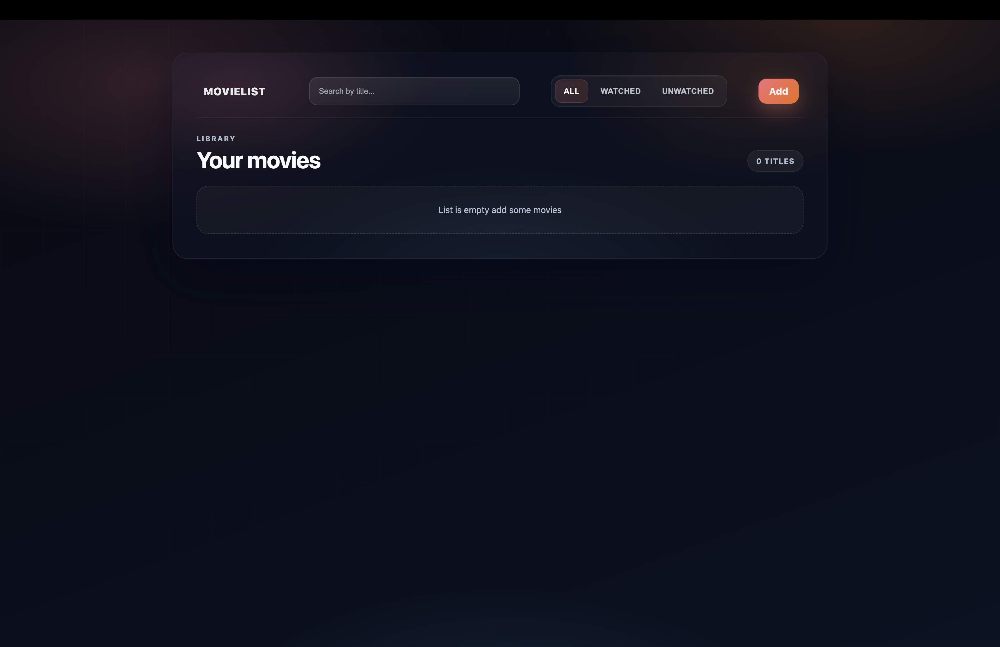
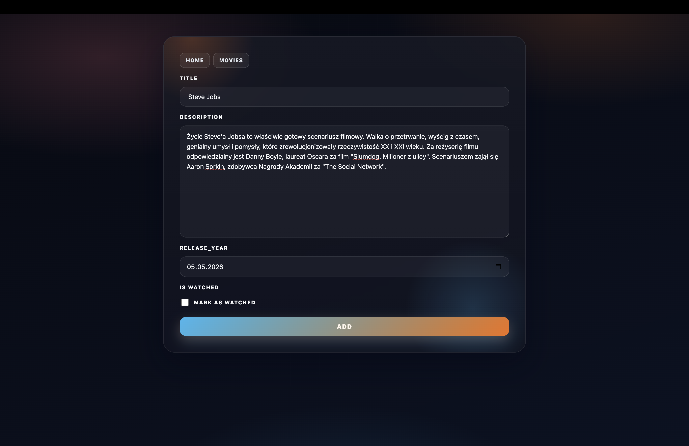
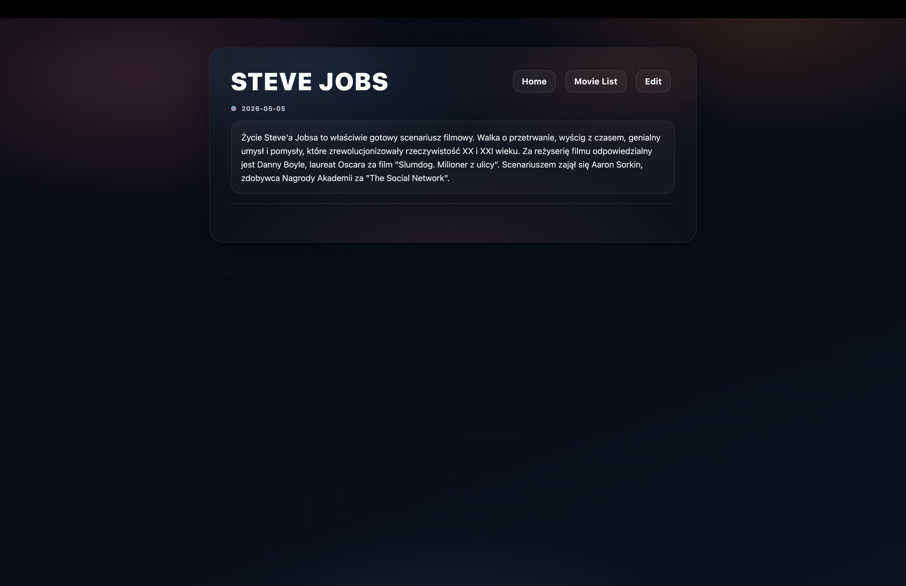

# Movie Watchlist


Full-stack CRUD app for managing a personal movie watchlist.

The project was built with React + Vite on the frontend and Django REST Framework on the backend. It allows users to browse movies, open details, add new entries, edit existing ones, delete records, and filter the collection in a simple responsive interface.

## Preview

### Home Page



### Movie List



### Empty State



### Add Movie Form



### Movie Details



## Features

- Browse the full movie collection
- Open movie details on a dedicated page
- Add a new movie with basic client-side validation
- Edit an existing movie
- Delete a movie with a confirmation modal
- Search movies by title
- Filter movies by status: `all`, `watched`, `unwatched`
- Show loading, empty, and no-results states
- Display success notifications for key actions
- Show a custom 404 page for invalid routes
- Use a responsive UI designed for desktop and mobile screens
- Use a REST API for create, read, update, and delete operations

## Tech Stack

- Frontend: React 19, Vite, React Router, Axios, React Hot Toast
- Backend: Django 6, Django REST Framework
- Database: SQLite
- Tooling: ESLint, Docker, Docker Compose

## Project Structure

```text
movie-watchlist/
|- backend/            # Django + DRF API
|- frontend/           # React application
|- docker-compose.yml
`- README.md
```

## Frontend Routes

- `/` - home page
- `/movies` - movie list
- `/movies/:id` - movie details
- `/movies/:id/edit` - edit movie form
- `/movies/add-movie` - add movie form
- `/404` - fallback page

## API

Base URL:

```text
http://localhost:8000/api/
```

Endpoints:

- `GET /movies/` - list all movies
- `POST /movies/` - create a movie
- `GET /movies/<id>/` - retrieve movie details
- `PUT /movies/<id>/` - full update
- `PATCH /movies/<id>/` - partial update
- `DELETE /movies/<id>/` - delete a movie

Movie fields:

- `title` - string, required, minimum 3 characters
- `description` - text, optional
- `release_year` - date in `YYYY-MM-DD` format
- `is_watched` - boolean

## Running Locally

### Requirements

- Python 3
- Node.js and npm

### 1. Backend

Create a `.env` file in the project root:

```env
SECRET_KEY=your_secret_key_here
```

Install dependencies and start the server:

```bash
cd backend
python3 -m venv venv
source venv/bin/activate
pip install -r requirements.txt
python manage.py migrate
python manage.py runserver
```

### 2. Frontend

Install dependencies and start the app:

```bash
cd frontend
npm install
npm run dev
```

App URLs:

- Frontend: `http://localhost:5173`
- Backend API: `http://localhost:8000/api/movies/`

## Running With Docker

```bash
docker compose up --build
```

## Available Scripts

Frontend:

```bash
npm run dev
npm run build
npm run lint
```

Backend:

```bash
python manage.py runserver
python manage.py test
```

## Testing

Backend API tests currently cover:

- `GET /movies/`
- `POST /movies/`
- `PATCH /movies/<id>/`
- `DELETE /movies/<id>/`

## What I Learned

- Building a full CRUD flow between a React frontend and a Django REST API
- Managing client-side routing with React Router
- Handling form state, validation, loading states, and API errors in React
- Designing reusable page layouts and responsive UI patterns
- Working with REST endpoints for listing, creating, editing, and deleting data
- Improving UX with empty states, confirmation dialogs, and toast notifications
- Writing basic backend API tests with Django REST Framework

## Notes

- Frontend API requests use `http://localhost:8000/api/` from `frontend/src/api/axios.js`
- The app currently uses local SQLite storage
- Authentication is not included in this project

## Author

Personal learning project focused on CRUD, routing, API integration, and improving frontend UX in a full-stack setup.
